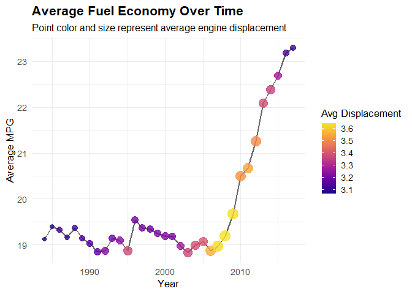
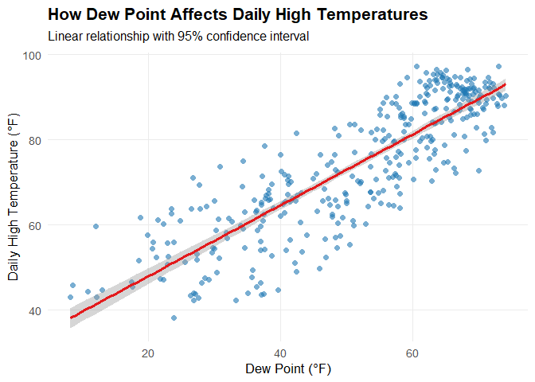
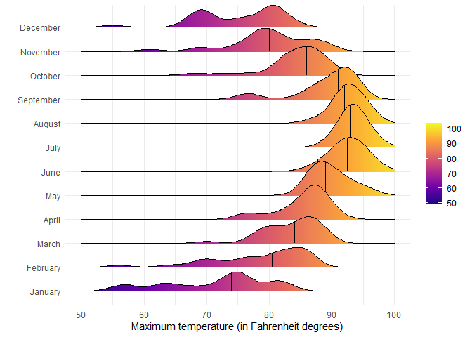

# Data Visualization and Reproducible Research

> Firstname Lastname. 

The following is a sample of products created during the _"Data Visualization and Reproducible Research"_ course.

## Project 01

In the `project_01/` folder you can find that I looked into fuel.csv taking a look engine size, engine cylinders, displacement as well as asipration over time to take a look at fuel economy. 

**Sample data visualization:** 

## Project 02

In this project, I explored the FL lakes shape file as well how peak temperature and dew point are related. Find the code and report in the `project_02/` folder.

**Sample data visualization:** 

## Project 03

In this project, I explored data on the weather in Tampa as well as cement and its factors to see how it ages as well as how its strength changes.

**Sample data visualization:** 

### Moving Forward

I learned about the different ways to display the same information and need to be more creative in showing this information to be able to be unique. I also learned about using git desktop which has made my life so much easier.