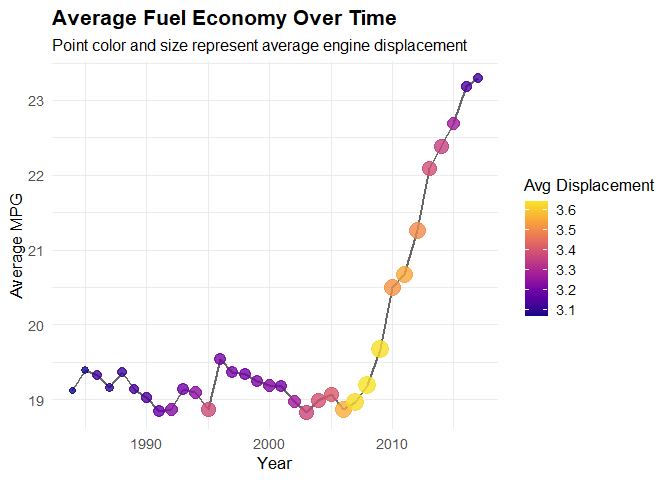
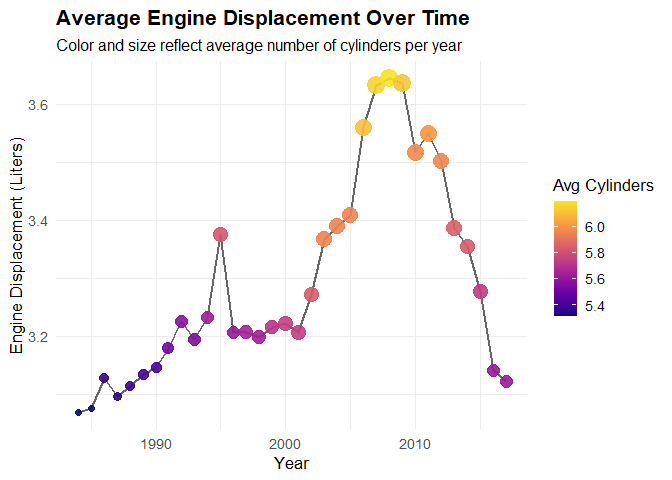

# Data Visualization Project 01
Loading the Tidyverse for all the packages I will need...

``` r
library(tidyverse)
```

```
## ── Attaching core tidyverse packages ──────────────────────── tidyverse 2.0.0 ──
## ✔ dplyr     1.1.4     ✔ readr     2.1.5
## ✔ forcats   1.0.0     ✔ stringr   1.5.1
## ✔ ggplot2   3.5.1     ✔ tibble    3.2.1
## ✔ lubridate 1.9.4     ✔ tidyr     1.3.1
## ✔ purrr     1.0.2     
## ── Conflicts ────────────────────────────────────────── tidyverse_conflicts() ──
## ✖ dplyr::filter() masks stats::filter()
## ✖ dplyr::lag()    masks stats::lag()
## ℹ Use the conflicted package (<http://conflicted.r-lib.org/>) to force all conflicts to become errors
```

``` r
library(viridis)
```

```
## Warning: package 'viridis' was built under R version 4.4.3
```

```
## Loading required package: viridisLite
```
Then loading readr loading the data.

``` r
library(readr)
fuel <- read_csv("data/fuel.csv")
```

```
## Rows: 38113 Columns: 81
## ── Column specification ────────────────────────────────────────────────────────
## Delimiter: ","
## chr (11): make, model, class, drive, transmission, transmission_type, engine...
## dbl (59): vehicle_id, year, engine_index, engine_cylinders, engine_displacem...
## lgl (11): turbocharger, supercharger, fuel_type_2, gas_guzzler_tax, start_st...
## 
## ℹ Use `spec()` to retrieve the full column specification for this data.
## ℹ Specify the column types or set `show_col_types = FALSE` to quiet this message.
```
After that creating a new column called Aspiration marking labeling cars that are turbocharged and supercharged as well as the naturally aspirated ones.

``` r
fuel <- fuel %>%
  mutate(
    Aspiration = case_when(
      turbocharger == TRUE ~ "Turbocharged",
      supercharger == TRUE ~ "Supercharged",
      TRUE ~ "Naturally Aspirated"
    )
  )
```

Then group by fuel type to see what cars need to be excluded due to unconventional fuel technology.

``` r
fuel %>% 
  group_by(fuel_type) %>% 
  summarise(n())
```

```
## # A tibble: 14 × 2
##    fuel_type                   `n()`
##    <chr>                       <int>
##  1 CNG                            60
##  2 Diesel                       1014
##  3 Electricity                   133
##  4 Gasoline or E85              1223
##  5 Gasoline or natural gas        20
##  6 Gasoline or propane             8
##  7 Midgrade                       77
##  8 Premium                     10133
##  9 Premium Gas or Electricity     18
## 10 Premium and Electricity        25
## 11 Premium or E85                122
## 12 Regular                     25258
## 13 Regular Gas and Electricity    20
## 14 Regular Gas or Electricity      2
```

Ensuring those fuel types are filtered out that are not important.

``` r
fuel <- fuel %>% 
  filter(!fuel_type %in% c("CNG", "Diesel", "Electricity","Gasoline or propane"))
```
I want to see how engine size and displacement change over time and effect fuel economy as well as turbos. 
Step one was to look at engine displacement which is linked to engine cylinders due to physics. To see fuel economy but also filtering by aspiration type as turbos as supposed to allow for a smaller engine but allow for it to be more efficient.


``` r
ggplot(fuel, aes(x = engine_displacement, y = combined_mpg_ft1, color = Aspiration)) +
  geom_point(alpha = 0.7, size = 2) +
  geom_smooth(se = FALSE, method = "loess", linewidth = 1.2) +
  scale_color_manual(
    values = c("Turbocharged" = "#E41A1C", "Naturally Aspirated" = "#377EB8"),
    name = "Aspiration Type"
  ) +
  scale_y_continuous(limits = c(0, 60), breaks = seq(0, 60, 10)) +
  scale_x_continuous(breaks = seq(0, max(fuel$engine_displacement, na.rm = TRUE), 1)) +
  labs(
    title = "Fuel Efficiency vs Engine Displacement",
    subtitle = "Comparing Turbocharged and Naturally Aspirated Engines",
    x = "Engine Displacement (L)",
    y = "Combined MPG"
  ) +
  theme_minimal(base_size = 13) +
  theme(
    plot.title = element_text(face = "bold", size = 16),
    plot.subtitle = element_text(size = 12, margin = margin(b = 10)),
    legend.position = "top",
    panel.grid.minor = element_blank()
  )
```

```
## `geom_smooth()` using formula = 'y ~ x'
```

```
## Warning: Removed 2 rows containing non-finite outside the scale range
## (`stat_smooth()`).
```

```
## Warning: Removed 2 rows containing missing values or values outside the scale range
## (`geom_point()`).
```

<!-- -->

Looking at th graph we can see that as the engine is bigger the lower the fuel economy. We can also see that turbos are helpful in certain applications but not all I am assuming this is due to the use of turbos trying to make a smaller engine simply more powerful but technically less efficient then the NA variant of the same size.

Next looking at displacement and cylinders by aspiration we can see that with smaller engines NA and turbo charged engines are the same but as engines get bigger turbo charged engines are smaller for the same number on cylinders which is to be expected as for the most effective cylinder it is almost perfect 500cc per cylinder which does line up. All the way until the big engines.

``` r
ggplot(fuel,mapping = aes(engine_displacement,engine_cylinders,colour = Aspiration))+geom_point()+geom_smooth(method="lm",se=FALSE)
```

```
## `geom_smooth()` using formula = 'y ~ x'
```

```
## Warning: Removed 3 rows containing non-finite outside the scale range
## (`stat_smooth()`).
```

```
## Warning: Removed 3 rows containing missing values or values outside the scale range
## (`geom_point()`).
```

<!-- -->
This next graph is showing us fuel economy overtime as well as engine displacement.Which shows us that in the beginning engines were just inefficient then after they made engines bigger which increased the drop in the early 2000s where after they made engines smaller which increased fuel economy.

``` r
fuel %>% 
  group_by(year) %>% 
  summarise(
    mean_mpg = mean(combined_mpg_ft1, na.rm = TRUE),
    mean_displacement = mean(engine_displacement, na.rm = TRUE)
  ) %>%
  ggplot(aes(x = year, y = mean_mpg)) +
  geom_line(color = "gray40", linewidth = 1) +
  geom_point(aes(color = mean_displacement, size = mean_displacement), alpha = 0.8) +
  scale_color_viridis_c(option = "plasma", end = 0.95, name = "Avg Displacement") +
  scale_size(range = c(2, 6), guide = "none") +
  labs(
    title = "Average Fuel Economy Over Time",
    subtitle = "Point color and size represent average engine displacement",
    x = "Year",
    y = "Average MPG"
  ) +
  theme_minimal(base_size = 13) +
  theme(
    plot.title = element_text(face = "bold", size = 16),
    plot.subtitle = element_text(size = 12),
    legend.position = "right"
  )
```

<!-- -->
Finally I just have a graph showing how engine displacement changed overtime with the average of cylinders as well further showing higher displacement does mean more cylinders as the trend holds throughout time. 

``` r
fuel %>% 
  group_by(year) %>% 
  summarise(
    mean_displacement = mean(engine_displacement, na.rm = TRUE),
    mean_cylinders = mean(engine_cylinders, na.rm = TRUE)
  ) %>%
  ggplot(aes(x = year, y = mean_displacement)) +
  geom_line(color = "gray40", linewidth = 1) +
  geom_point(aes(color = mean_cylinders, size = mean_cylinders), alpha = 0.9) +
  scale_color_viridis_c(option = "plasma", end = 0.95, name = "Avg Cylinders") +
  scale_size(range = c(2, 6), guide = "none") +
  labs(
    title = "Average Engine Displacement Over Time",
    subtitle = "Color and size reflect average number of cylinders per year",
    x = "Year",
    y = "Engine Displacement (Liters)"
  ) +
  theme_minimal(base_size = 13) +
  theme(
    plot.title = element_text(face = "bold", size = 16),
    plot.subtitle = element_text(size = 12),
    legend.position = "right"
  )
```

<!-- -->


### What were the original charts you planned to create for this assignment?
The goal was to explore how engine displacement, number of cylinders, and the use of aspiration (e.g., turbocharging) have evolved over time. I initially planned to use line plots and grouped comparisons to visualize these trends clearly across multiple years.

### What story could you tell with your plots?
The plots reveal a story of technological progress. Early automotive engines were larger and less efficient. Over time, we see a shift toward smaller engines with better fuel economy. Turbocharging plays a key role in this transition—allowing smaller engines to deliver more power without sacrificing efficiency. Additionally, the trends may reflect periods of high gas prices, where automakers responded by engineering more fuel-efficient vehicles.

### How did you apply the principles of data visualization and design in this assignment?
I focused on clarity and simplicity. I used color strategically to distinguish between variables and highlight trends. I also performed quick data wrangling to prepare the dataset for analysis. Line plots were used to emphasize changes over time, and I made an effort to convey the key insights using the fewest number of visualizations necessary, without overwhelming the viewer.


``` r
library(tidyverse)
library(viridis)
```


