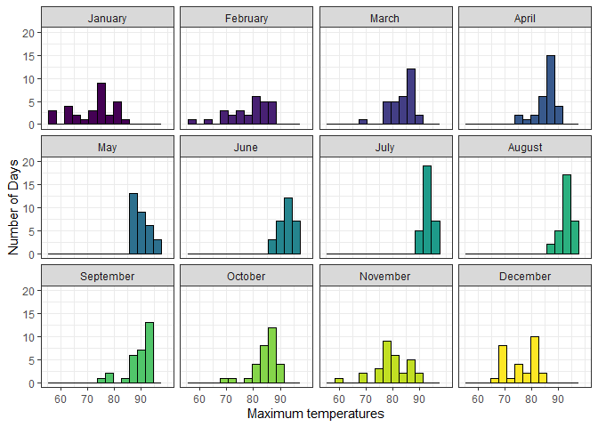
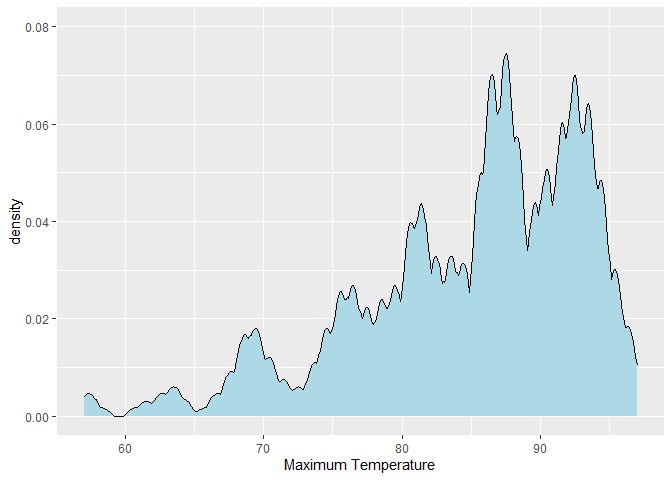
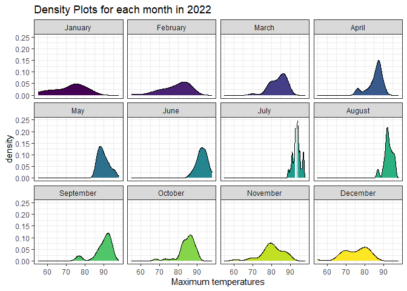
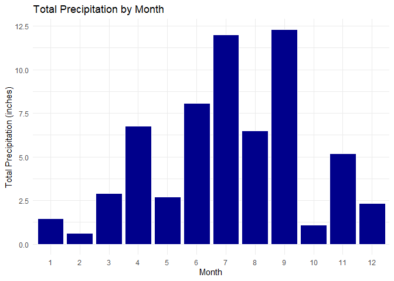
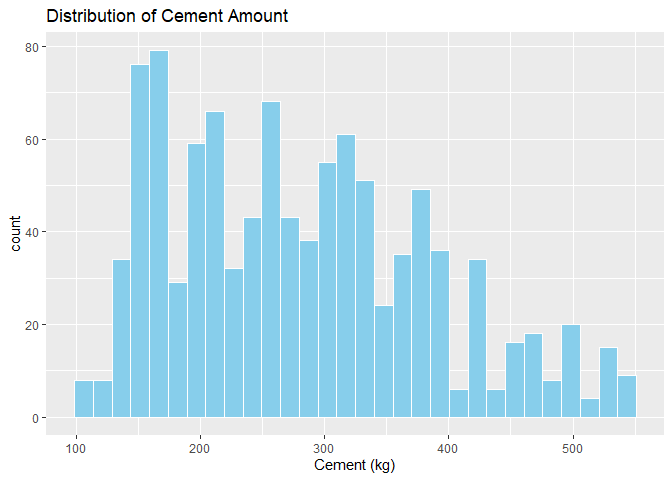
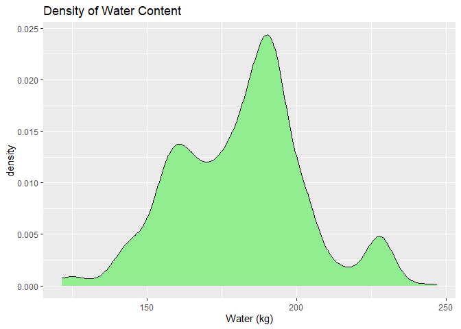
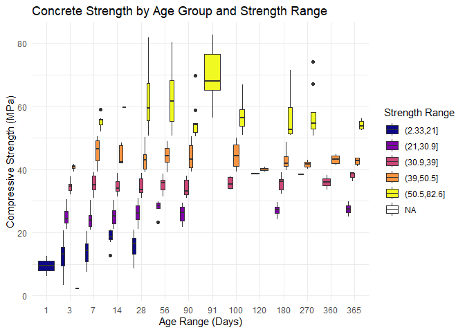
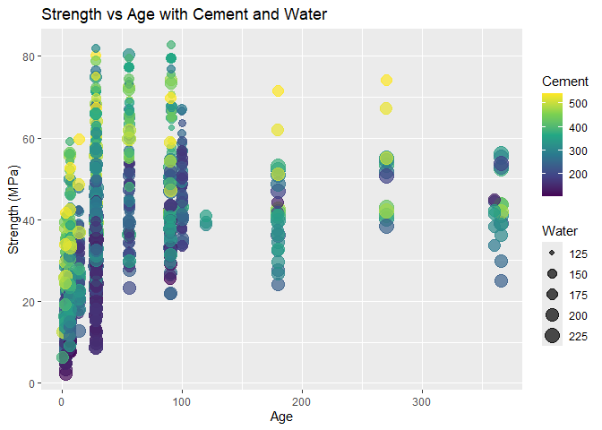

# Data Visualization Project 03


In this exercise you will explore methods to create different types of data visualizations (such as plotting text data, or exploring the distributions of continuous variables).


## PART 1: Density Plots

Using the dataset obtained from FSU's [Florida Climate Center](https://climatecenter.fsu.edu/climate-data-access-tools/downloadable-data), for a station at Tampa International Airport (TPA) for 2022, attempt to recreate the charts shown below which were generated using data from 2016. You can read the 2022 dataset using the code below: 


``` r
library(tidyverse)
library(ggridges)
library(lubridate)
library(viridis)
weather_tpa <- read_csv("https://raw.githubusercontent.com/aalhamadani/datasets/master/tpa_weather_2022.csv")
# random sample 
sample_n(weather_tpa, 4)
```

```
## # A tibble: 4 × 7
##    year month   day precipitation max_temp min_temp ave_temp
##   <dbl> <dbl> <dbl>         <dbl>    <dbl>    <dbl>    <dbl>
## 1  2022     4    21             0       87       67     77  
## 2  2022    12     6             0       81       66     73.5
## 3  2022    12    27             0       68       40     54  
## 4  2022    12    11             0       70       64     67
```

See Slides from Week 4 of Visualizing Relationships and Models (slide 10) for a reminder on how to use this type of dataset with the `lubridate` package for dates and times (example included in the slides uses data from 2016).

Using the 2022 data: 

(a) Create a plot like the one below:

``` r
weather_tpa <- weather_tpa %>%
  mutate(date = make_date(year, month, day),
         month_name = month(date, label = TRUE,abbr = FALSE))

weather_tpa %>% 
  filter(month==06) %>% 
  select(max_temp) %>% 
  arrange(max_temp)
```

```
## # A tibble: 30 × 1
##    max_temp
##       <dbl>
##  1       86
##  2       88
##  3       88
##  4       89
##  5       90
##  6       90
##  7       91
##  8       91
##  9       91
## 10       91
## # ℹ 20 more rows
```


``` r
weather_tpa %>%
  ggplot(aes(x = max_temp, fill = month_name)) +
  geom_histogram(binwidth = 3, color = "black") +
  facet_wrap(~ month_name) +
  scale_x_continuous(limits = c(55, 100), breaks = seq(60, 90, 10)) +
  scale_y_continuous(limits = c(0, 20), breaks = seq(0, 20, 5)) +
 scale_fill_viridis_d(option = "viridis", guide = "none") + 
  labs(x = "Maximum temperatures",
       y = "Number of Days") +
  theme_bw()
```

```
## Warning: Removed 2 rows containing non-finite outside the scale range
## (`stat_bin()`).
```

```
## Warning: Removed 24 rows containing missing values or values outside the scale range
## (`geom_bar()`).
```

<!-- -->


Hint: the option `binwidth = 3` was used with the `geom_histogram()` function.

(b) Create a plot like the one below:


``` r
ggplot(weather_tpa, aes(x = max_temp)) +
  geom_density(kernel = "epanechnikov", bw = 0.5, fill = "lightblue") +
  scale_x_continuous(limits = c(57, 97), breaks = seq(60, 90, 10)) +
  scale_y_continuous(limits = c(0, .08), breaks = seq(0, .08, .02)) +
  labs( x = "Maximum Temperature")
```

```
## Warning: Removed 6 rows containing non-finite outside the scale range
## (`stat_density()`).
```

<!-- -->


Hint: check the `kernel` parameter of the `geom_density()` function, and use `bw = 0.5`.

(c) Create a plot like the one below:


``` r
weather_tpa %>%
  ggplot(aes(x = max_temp, fill = month_name)) +
  geom_density(color = "black") +
  facet_wrap(~ month_name) +
  scale_x_continuous(limits = c(55, 98), breaks = seq(60, 90, 10)) +
  scale_y_continuous(limits = c(0, .25), breaks = seq(0, .25, .05)) +
 scale_fill_viridis_d(option = "viridis", guide = "none") + 
  labs(title = "Density Plots for each month in 2022",
    x = "Maximum temperatures")+
  theme_bw()
```

```
## Warning: Removed 2 rows containing non-finite outside the scale range
## (`stat_density()`).
```

<!-- -->


Hint: default options for `geom_density()` were used. 

(d) Generate a plot like the chart below:


``` r
ggplot(weather_tpa, aes(x = max_temp, y = month_name,fill = stat(x))) +
  geom_density_ridges_gradient(quantile_lines = TRUE, quantiles = 2) +
  scale_fill_viridis_c(option = "plasma",name = "") +
  scale_x_continuous(limits = c(50, 100), breaks = seq(50, 100, 10)) +
  labs(y="", x = "Maximum temperature (in Fahrenheit degrees)")+
  theme_minimal()
```

```
## Warning: `stat(x)` was deprecated in ggplot2 3.4.0.
## ℹ Please use `after_stat(x)` instead.
## This warning is displayed once every 8 hours.
## Call `lifecycle::last_lifecycle_warnings()` to see where this warning was
## generated.
```

```
## Picking joint bandwidth of 1.87
```

<!-- -->

Hint: use the`{ggridges}` package, and the `geom_density_ridges()` function paying close attention to the `quantile_lines` and `quantiles` parameters. The plot above uses the `plasma` option (color scale) for the _viridis_ palette.


(e) Create a plot of your choice that uses the attribute for precipitation _(values of -99.9 for temperature or -99.99 for precipitation represent missing data)_.

``` r
weather_tpa %>% 
  group_by(month) %>%
  summarise(total_precip = sum(precipitation, na.rm = TRUE)) %>%
  ggplot(aes(x = factor(month), y = total_precip)) +
  geom_col(fill = "darkblue", color = "white") +
  labs(title = "Total Precipitation by Month", x = "Month", y = "Total Precipitation (inches)") +
  theme_minimal()
```

<!-- -->


## PART 2 

> **You can choose to work on either Option (A) or Option (B)**. Remove from this template the option you decided not to work on. 


### Option (B): Data on Concrete Strength 

Concrete is the most important material in **civil engineering**. The concrete compressive strength is a highly nonlinear function of _age_ and _ingredients_. The dataset used here is from the [UCI Machine Learning Repository](https://archive.ics.uci.edu/ml/index.php), and it contains 1030 observations with 9 different attributes 9 (8 quantitative input variables, and 1 quantitative output variable). A data dictionary is included below: 


Variable                      |    Notes                
------------------------------|-------------------------------------------
Cement                        | kg in a $m^3$ mixture             
Blast Furnace Slag            | kg in a $m^3$ mixture  
Fly Ash                       | kg in a $m^3$ mixture             
Water                         | kg in a $m^3$ mixture              
Superplasticizer              | kg in a $m^3$ mixture
Coarse Aggregate              | kg in a $m^3$ mixture
Fine Aggregate                | kg in a $m^3$ mixture      
Age                           | in days                                             
Concrete compressive strength | MPa, megapascals


Below we read the `.csv` file using `readr::read_csv()` (the `readr` package is part of the `tidyverse`)


``` r
concrete <- read_csv("../data/concrete.csv", col_types = cols())
```


Let us create a new attribute for visualization purposes, `strength_range`: 


``` r
new_concrete <- concrete %>%
  mutate(strength_range = cut(Concrete_compressive_strength, 
                              breaks = quantile(Concrete_compressive_strength, 
                                                probs = seq(0, 1, 0.2))) )
```


1. Explore the distribution of 2 of the continuous variables available in the dataset. Do ranges make sense? Comment on your findings.

``` r
ggplot(new_concrete, aes(x = Cement)) +
  geom_histogram(fill = "skyblue", color = "white", bins = 30) +
  labs(title = "Distribution of Cement Amount", x = "Cement (kg)")
```

<!-- -->

``` r
range(concrete$Cement, na.rm = TRUE)
```

```
## [1] 102 540
```

``` r
ggplot(new_concrete, aes(x = Water)) +
  geom_density(fill = "lightgreen") +
  labs(title = "Density of Water Content", x = "Water (kg)")
```

<!-- -->

``` r
range(concrete$Water, na.rm = TRUE)
```

```
## [1] 121.75 247.00
```
#The ranges of water and cement seem possible.
2. Use a _temporal_ indicator such as the one available in the variable `Age` (measured in days). Generate a plot similar to the one shown below. Comment on your results.


``` r
new_concrete <- new_concrete %>%
  mutate(age_factor = factor(Age))

ggplot(new_concrete, aes(x = age_factor, y = Concrete_compressive_strength, fill = strength_range)) +
  geom_boxplot() +
  scale_fill_viridis_d(option = "plasma", name = "Strength Range") +
  labs(
    title = "Concrete Strength by Age Group and Strength Range",
    x = "Age Range (Days)",
    y = "Compressive Strength (MPa)"
  ) +
  theme_minimal()
```

<!-- -->
#As Cement ages it gets stronger generally speaking.

3. Create a scatterplot similar to the one shown below. Pay special attention to which variables are being mapped to specific aesthetics of the plot. Comment on your results. 


``` r
ggplot(new_concrete, aes(x = Age, y = Concrete_compressive_strength,
                          size = Water,color = Cement)) +
  geom_point(alpha = 0.7) +
  scale_color_viridis_c() +
  labs(title = "Strength vs Age with Cement and Water", x = "Age", y = "Strength (MPa)")
```

<!-- -->
#Cement is stronger over time and that less water tends to help make it stronger. In thoery a higher cement to water ratio is best.


